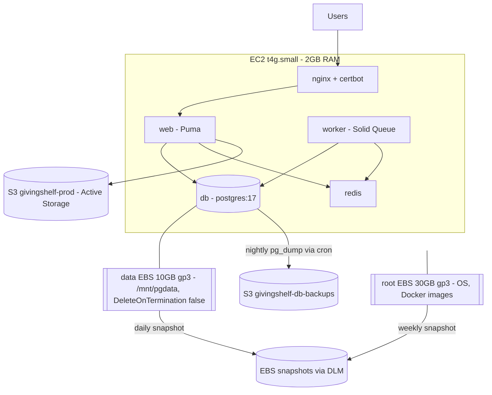

## Migrate Production Postgres from RDS into Docker on EC2

### Target state




Four databases move together: `givingshelf_prod` (primary) plus `givingshelf_production_cache`, `givingshelf_production_queue`, and `givingshelf_production_cable` for Solid Cache, Solid Queue, and Solid Cable.

Three independent layers of protection, each covering a different failure: EBS snapshots for whole-volume loss or instance termination, `pg_dump` to S3 for logical corruption and off-instance durability, and the RDS final snapshot as the rollback path during the first week.

---

### Part 1: Code changes (I make these, on a branch)

**1a. Remove the volume-pruning landmine**

In [.github/workflows/deploy.yml](.github/workflows/deploy.yml), the disk-pressure cleanup currently reads:

```bash
docker system prune -a --volumes -f
```

Change to `docker system prune -a -f`. Dropping `--volumes` still reclaims images, stopped containers, networks, and build cache, which is where all the space actually is.

Putting Postgres on a bind mount (1b) already protects the database from this, so this is no longer the critical item it would otherwise be. It still matters for `redis_data`, which holds the append-only file, and for `rails_storage`. Keeping a `--volumes` prune in an automated deploy path is a bad default regardless of what currently happens to live in a volume.

**1b. Add the `db` service to [docker-compose.production.yml](docker-compose.production.yml)**

- `image: postgres:17.6` — pin the minor version explicitly rather than floating `17`. A floating tag that ever resolves to a new major version will refuse to start against an existing data directory.
- `container_name: givingshelf-db`, `restart: unless-stopped`
- `env_file: [.env]` so it picks up `POSTGRES_USER`, `POSTGRES_PASSWORD`, `POSTGRES_DB`
- **Bind mount the dedicated EBS volume**, not a Docker named volume: `/mnt/pgdata:/var/lib/postgresql/data`, with `PGDATA=/var/lib/postgresql/data/pgdata`. The `PGDATA` subdirectory is required, not cosmetic — a freshly formatted ext4 volume contains `lost+found`, and `initdb` refuses to initialize into a non-empty directory.
- A bind mount also means `docker volume`-based commands can never touch the data, which removes the entire deletion risk class described in 1a for the database specifically.
- No `ports:` mapping — reachable only on the `givingshelf` bridge network, never exposed to the internet
- `healthcheck` using `pg_isready -U $POSTGRES_USER`, 5s interval, 10 retries
- `stop_grace_period: 60s`. The official image stops via SIGINT for a fast shutdown, but Compose's default 10-second timeout can SIGKILL Postgres mid-checkpoint on every deploy and reboot, forcing crash recovery on next start.
- Memory-tuned startup flags for a 2GB box: `-c max_connections=50 -c shared_buffers=192MB -c effective_cache_size=512MB -c work_mem=4MB -c maintenance_work_mem=64MB`
- Add `db: {condition: service_healthy}` to `depends_on` on both `web` and `worker` so Rails never boots before Postgres accepts connections
- Add `mem_limit` to `web` (768m) and `worker` (512m). Without limits, a Rails memory leak can get Postgres chosen by the OOM killer; when the kernel kills a Postgres backend, Postgres restarts every backend and drops all connections. Bounding Rails makes it the victim instead of the database.

**1c. Make `sslmode` environment-driven in [config/database.yml](config/database.yml)**

Line 33 hardcodes `sslmode: require` on the production primary, which fails against a container with no TLS. Change to:

```yaml
sslmode: <%= ENV.fetch("DATABASE_SSLMODE", "require") %>
```

Keeps `require` as the safe default and lets production set `disable`. The `cache`, `queue`, and `cable` entries need no change — they set no `sslmode`, so libpq defaults to `prefer` and falls back to plaintext cleanly.

**1d. Maintenance page for the cutover**

- New `deploy/nginx/maintenance/maintenance.html` — fully self-contained static page, no asset pipeline dependency
- Mount `./deploy/nginx/maintenance:/var/www/maintenance:ro` on the `nginx` service
- In [deploy/nginx/nginx.conf](deploy/nginx/nginx.conf), in the apex `givingshelf.net` server block and the `*.givingshelf.net` block, add inside `location /`:

```nginx
if (-f /var/www/maintenance/on) { return 503; }
```

plus a sibling `error_page 503 /maintenance.html;` and an `internal` `location = /maintenance.html` rooted at `/var/www/maintenance`. Scoping the check to `location /` leaves `/healthz` responding normally. Because it is a bind mount evaluated per request, `touch`/`rm` of the flag file toggles maintenance instantly with no nginx reload.

**1e. Backup script `deploy/backup-db.sh`**

Runs `pg_dump -Fc` for all four databases inside the `postgres:17` container, gzips, uploads to `s3://givingshelf-db-backups/YYYY/MM/DD/<db>.dump.gz` using the EC2 instance role, deletes local temp files, and exits non-zero on any failure so cron mail surfaces it.

**1f. Restore script `deploy/restore-db.sh`**

Takes a date prefix, pulls the four dumps from S3, and runs `pg_restore --clean --if-exists --no-owner --no-acl`. Existing as a tested script matters more than the migration itself — an untested backup is not a backup.

**1g. Housekeeping**

- Fix [deploy/rds-setup.sql](deploy/rds-setup.sql), which creates `givingshelf_prod_cache/queue/cable` while [config/database.yml](config/database.yml) expects `givingshelf_production_cache/queue/cable`. Repurpose it as the container bootstrap with correct names.
- Add `givingshelf-db` to [deploy/setup-docker-logs.sh](deploy/setup-docker-logs.sh) and a matching log group in [deploy/cloudwatch-config.json](deploy/cloudwatch-config.json)
- Update [deploy/aws_prod_deploy_setup_steps.md](deploy/aws_prod_deploy_setup_steps.md) to describe the container topology instead of RDS

---

### Part 2: Manual AWS console / CLI steps (you do these, before cutover)

**2a. Create and mount a dedicated EBS volume for Postgres data**

This is the highest-value step in the whole plan. It isolates the database from Docker's disk churn, survives instance termination, and can be snapshotted and re-attached to a rebuilt instance — which is what turns your recovery time from hours into minutes.

- EC2 → Volumes → Create volume: 10 GiB, gp3, **same Availability Zone as your instance** (a volume cannot attach across AZs), **Encryption enabled**. Encryption can only be set at creation; retrofitting it later requires a snapshot-and-copy cycle.
- Tag it `Name=givingshelf-pgdata` and `Backup=daily` (the tag drives the snapshot policy in 2d)
- Attach to your instance as `/dev/sdf`. On Nitro instances this surfaces as `/dev/nvme1n1`; confirm with `lsblk`.
- Verify **DeleteOnTermination is false** for this attachment. Volumes attached after launch default to false, which is what you want, but confirm it — this is the property that protects you from an accidental instance termination.
- Format and mount: `sudo mkfs.ext4 /dev/nvme1n1`, `sudo mkdir -p /mnt/pgdata`, then add an `/etc/fstab` entry **by UUID, not device name** (`blkid` to get it), since NVMe device names can shift across reboots. Include `nofail` so a missing volume never blocks boot.
- Create the data subdirectory and set ownership for the container's postgres user: `sudo mkdir -p /mnt/pgdata/pgdata && sudo chown -R 999:999 /mnt/pgdata/pgdata && sudo chmod 700 /mnt/pgdata/pgdata`
- Reboot once before the cutover to prove the mount comes back automatically. Discovering a broken `fstab` entry after the database is live is much worse.

**2b. Create the backup bucket**

- S3 → Create bucket → `givingshelf-db-backups`, region `us-west-2`
- Block all public access: ON (leave the default)
- Default encryption: SSE-S3
- Lifecycle rule: expire current versions after 30 days, and abort incomplete multipart uploads after 7 days

**2c. Grant the EC2 instance role write access to it**

Your [config/storage.yml](config/storage.yml) `amazon_production` entry sets no credentials, so the instance already uses its IAM role for S3. Find that role (EC2 → your instance → Security → IAM Role) and attach an inline policy allowing `s3:PutObject`, `s3:GetObject`, `s3:ListBucket`, and `s3:DeleteObject` on `arn:aws:s3:::givingshelf-db-backups` and `arn:aws:s3:::givingshelf-db-backups/*`. I will provide the exact JSON.

**2d. Set up daily EBS snapshots via Data Lifecycle Manager**

A machine-level restore point that works even if the `pg_dump` cron has silently broken. Snapshots are incremental, so ongoing cost is small.

- EC2 → Lifecycle Manager → Create snapshot lifecycle policy, targeting volumes by the `Backup=daily` tag
- Data volume: daily, retain 7. Very cheap, since only a small amount of the 10 GiB is actually used.
- Root volume: tag it `Backup=weekly` and add a second policy, weekly, retain 4. The root is mostly static Docker images, so daily snapshots of it buy little for the cost.
- Enable "Copy tags from source" so restored volumes stay identifiable
- Note the crash-consistency caveat: an EBS snapshot of a running database is equivalent to pulling the power cord. Postgres recovers from this via WAL replay on start, which is reliable, but it is a weaker guarantee than the `pg_dump` output. That is precisely why you keep both.

**2e. Check root disk headroom**

On EC2, run `df -h /` and `docker system df`. With Postgres on its own volume this is far less urgent than it was, so the 40GB root upgrade is now optional rather than recommended — the root only needs to hold the OS, Docker images, and build cache. Still worth confirming you are not already near the 85% threshold that triggers the deploy-time prune.

**2f. Add a swap file**

`t4g.small` has 2GB and will now run Puma, Solid Queue, Redis, nginx, and Postgres. Create a 2GB swap file and add it to `/etc/fstab` so it survives reboot. Put it on the root volume, not the Postgres data volume. I will provide the commands.

**2g. Generate a Postgres password and stage the secret changes**

Generate a strong password. In Secrets Manager, secret `givingshelf/prod/env`, prepare these values but do not save until the cutover step:

- `DATABASE_URL` → `postgresql://gs_user:<password>@db:5432/givingshelf_prod`
- `DATABASE_SSLMODE` → `disable`
- `POSTGRES_USER` → `gs_user`
- `POSTGRES_PASSWORD` → `<password>`
- `POSTGRES_DB` → `givingshelf_prod`

Note that `POSTGRES_*` are read by the postgres image only on first initialization of an empty volume. Changing them later has no effect, so get the password right the first time.

---

### Part 3: Cutover (manual, on EC2, roughly 30 minutes)

Sequenced so the risky work happens under your eye rather than inside an auto-triggered deploy. Note that [.github/workflows/deploy.yml](.github/workflows/deploy.yml) fires on CI success against `main`, so the branch merge happens last, after the data is already safe.

1. **Dump RDS while it is still healthy.** With the app still running, `pg_dump -Fc` all four databases from RDS to `/home/ubuntu/db-migration/`, then copy them to S3. Verify with `pg_restore --list` that each dump is readable. Do not proceed until you have a verified dump off-instance.
2. **Maintenance on.** `touch deploy/nginx/maintenance/on`, confirm the site serves the maintenance page, and confirm `/healthz` still returns 200.
3. **Stop writers.** `docker compose -f docker-compose.production.yml stop web worker`. Re-dump the primary to capture anything written during step 1 (belt and braces at this data size).
4. **Check out the migration branch on EC2.** `git fetch origin && git checkout <branch>`. This matches how the deploy script already manipulates the working tree.
5. **Save the secret changes** from step 2g in Secrets Manager, then `sudo /usr/local/bin/fetch-givingshelf-secrets.sh` to materialize `/etc/givingshelf/.env.production`.
6. **Confirm the data volume is mounted and empty-but-ready.** `findmnt /mnt/pgdata` should show the volume, and `ls -la /mnt/pgdata/pgdata` should show an empty directory owned by `999:999`. If Postgres initializes against an unmounted path it will silently write to the root volume instead, and you will not notice until the disk fills.
7. **Start Postgres alone.** `docker compose -f docker-compose.production.yml up -d db`, wait for the healthcheck, then create the three non-primary databases.
8. **Compare collation before trusting the restore.** Run `SHOW lc_collate;` and `SHOW lc_ctype;` on both RDS and the new container. If they differ, text indexes sort differently and you get subtle query bugs rather than a clean failure. Resolve this before restoring, not after.
9. **Restore all four** with `pg_restore --clean --if-exists --no-owner --no-acl`.
10. **Spot-check the data** directly in psql: row counts on `users`, `items`, `item_requests`, `community_groups`, and `messages` against what RDS reported before the dump.
11. **Bring the app up** and run `rails db:migrate:status` for all four databases. Exercise a real write — create a test item, confirm a background job runs, confirm Action Cable chat connects.
12. **Maintenance off.** `rm deploy/nginx/maintenance/on`.
13. **Merge the branch to `main`.** The auto-deploy then reapplies the same code, re-fetches secrets, rebuilds, runs a no-op `db:prepare`, and restarts. Data persists on the mounted volume. This is the real test that the pipeline is consistent with the new topology.
14. **Reboot the instance once, deliberately.** Confirm the volume remounts from `fstab`, `givingshelf.service` brings the stack back, and Postgres starts cleanly against the existing data directory. Better to find a boot-order problem now than during an unplanned restart.

---

### Part 4: Backups and verification (same day, non-negotiable)

1. Run `deploy/backup-db.sh` manually and confirm objects land in S3.
2. Install the nightly cron: `0 3 * * * cd /home/ubuntu/givingshelf && ./deploy/backup-db.sh >> /var/log/db-backup.log 2>&1`.
3. **Test the restore for real.** Restore last night's dump into a throwaway database in the same container and compare row counts. A backup you have never restored is a guess.
4. Add a CloudWatch alarm on backup freshness, or at minimum a calendar reminder to eyeball `/var/log/db-backup.log` weekly. Silent backup failure is the main way this architecture bites you.
5. Confirm the existing disk and memory alarms from [deploy/create-cloudwatch-alarms.sh](deploy/create-cloudwatch-alarms.sh) are actually active, since both metrics now matter much more. Add `/mnt/pgdata` to the `disk` resources list in [deploy/cloudwatch-config.json](deploy/cloudwatch-config.json), which currently only watches `/`.
6. After 24 hours, confirm the DLM policy actually produced a snapshot. A lifecycle policy that silently never runs is a common and expensive surprise.
7. **Practice the rebuild once, on paper at minimum.** Write down the recovery runbook: launch instance, install Docker, clone repo, attach the pgdata volume (or restore its latest snapshot to a new volume), fetch secrets, `up -d`. The value of the separate volume is entirely contingent on you knowing this sequence when it matters.

---

### Part 5: Decommission RDS (after about a week of stability)

Leave RDS running and untouched for roughly a week as your rollback path. Rolling back is just reverting `DATABASE_URL` to the RDS endpoint and setting `DATABASE_SSLMODE=require`.

Once satisfied:

1. RDS → `givingshelf-prod` → Actions → Delete, with a final snapshot named `givingshelf-prod-final-<date>`
2. Note that snapshot storage still bills at about $0.095/GB of actual data — small, but delete the snapshot after a few weeks
3. Delete the now-unused `givingshelf-rds-sg` security group
4. Confirm on next month's bill that the Relational Database Service line is gone

Do not stop the instance instead of deleting it. A stopped RDS instance still bills for all 40GB of storage and auto-restarts after 7 days.

---

### Cost outcome

- Now: $23.76/month, of which RDS is $16.50
- After: roughly $9.30/month — $3.72 public IPv4, $2.40 root EBS, $0.80 pgdata EBS, $0.80 Secrets Manager, roughly $1.50 EBS snapshots, pennies for S3 backup storage
- January, when the Graviton free trial ends: roughly $22/month, versus roughly $35/month had you kept RDS on-demand

The three hardening items add about $2.80/month over the bare $6.50 version. That is the cheapest durability you will ever buy relative to what it protects.

### Risks accepted

Still real after hardening:

- **Recovery point is still nightly, not point-in-time.** EBS snapshots are crash-consistent daily images and `pg_dump` is nightly, so worst case is losing up to a day of writes. RDS gave you any-second recovery. Closing this gap properly means WAL archiving to S3 with something like pgBackRest or wal-g, which is a meaningfully larger project. Revisit when real users depend on the data.
- **No automated failover.** An instance or AZ loss still means a manual rebuild. The separate volume and snapshots cut that from hours to minutes, but it is not automatic and it is not zero.
- **Memory pressure on 2GB.** Mitigated by swap, the tuned Postgres flags, and `mem_limit` on the Rails containers, but worth watching `mem_used_percent` closely for the first couple of weeks.
- **You now own minor version patching.** RDS applied these in a maintenance window. Pinning to `postgres:17.6` makes upgrades deliberate, which means they will not happen unless you schedule them.
- **CPU credits.** Postgres now competes with Puma and asset precompilation for a 20%-per-vCPU baseline. Unlike RDS, EC2 does let you switch to standard credit mode if you would rather be throttled than billed for surplus.

Substantially mitigated by this plan:

- Accidental `docker volume` deletion, since the data is a bind mount on a separate filesystem
- Accidental instance termination, since `DeleteOnTermination` is false on the data volume
- Disk exhaustion from Docker churn, since database storage no longer shares a filesystem with images and build cache
- Corruption from SIGKILL during deploys, via `stop_grace_period`

And the whole thing stays **reversible** — moving back to RDS later is the same dump-and-restore in the other direction, which is precisely why this is a safer bet than a one-year reserved instance.

### Deliberately out of scope

The Secrets Manager to SSM Parameter Store swap ($0.80/month) is a good change but unrelated, and bundling it into a database migration means two things to debug if the cutover misbehaves. Worth doing as a follow-up.